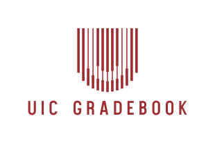

# UIC Grade Distribution Web Application 

## Introduction

Welcome to the UIC Grade Distribution Web Application! This application enhances the accessibility of UIC grade distribution data with intuitive navigation, clear visualization of grade trends, innovative presentation of grade distributions, advanced search, and options to track and share academic achievements.

## Key Features

- Intuitive Navigation
- Clear Visualization of Grade Trends
- Innovative Presentation of Grade Distributions
- Advanced Search Feature
- Options to Track and Share Academic Achievements

## Technical Stack

- Backend: NodeJS with Express
- Database: SQLite (data up to Spring 2023)
- Frontend: TypeScript + React
- UI Library: NextUI
- Visualization Library: d3

## Installation

### Prerequisites

- Node.js (Latest LTS version)
- Git

### Clone the Repository
```
git clone https://github.com/Al3ssandro-create/CS-422-Project
cd CS-422-Project
```
### Running the Server
```
cd server
npm install
node index.js
```
### Running the Frontend
```
cd uic-gradebook
npm install
npm run dev
```
## Usage

Access the application via `localhost:<port>` after starting both the server and frontend.

## Contributing

Contributions are welcome. Feel free to fork the repository and submit pull requests.

## Contact

Alessandro Martinolli:[alessandro.martinolli@live.it]

Riccardo Strina: [riccardo.strina@icloud.com]

